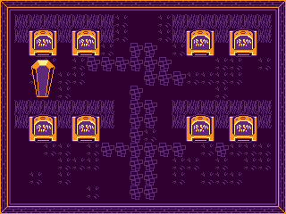
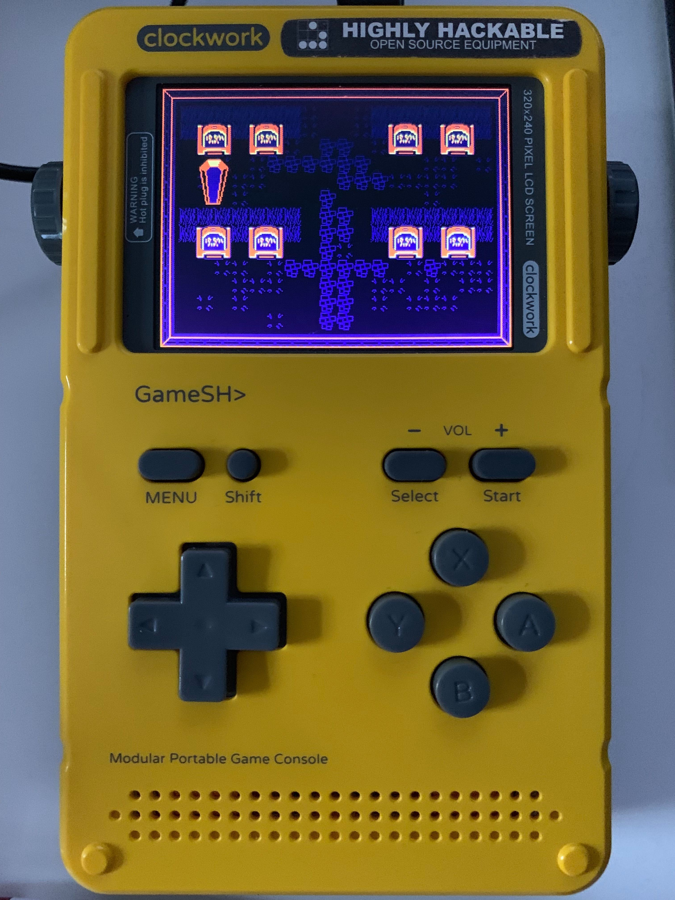

# graveyard-shift
---
# Graveyard Shift
A Clockworkpi GameShell Game Jam Game
---
Graveyard Shift is a tower defense style game where you play as a night owl (WHOOO?!?) who's job is to defend the graves from invading robbers.
It is developed in Godot 3.1.1 for release on ClockworkPi GameShell clockworkos v0.4 for their Q3 2019 game jam themed "Shift."

## Controls:
> Using SNES-style button layout

* Menu - Exit game to CPi GameShell main menu/dashboard (Esc)
* Start - Start or pause the game
* D-pad - Move player character "night owl" or move menu selection (Arrow keys)
* A button - Attack (swoop), menu select
* B button - menu cancel
* X button - Place bear trap
* Y button - Drop poison cloud
* Shift + X button - Place caltrops
* Shift + Y button - Drop flashbang

## Game Phases:
There are two main phases:
1) Set traps and prepare for invading robbers
2) A wave of invaders approaches and you must defend the graves' treasures

In between a cycle of each two phases you'll get a score based on how many waves you've survived multiplied by treasures that are left.

The game ends once all the treasures are stolen.
